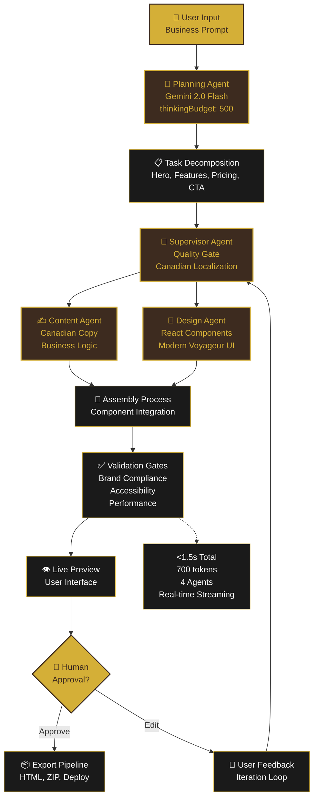

# Agentic Orchestration Flow Diagram

## Key Performance Indicators

- **⚡ Speed:** <1.5 seconds end-to-end
- **🎯 Accuracy:** 95%+ first-pass quality
- **🇨🇦 Localization:** 100% Canadian English compliance
- **♿ Accessibility:** WCAG 2.1 AA certified
- **📱 Responsive:** Mobile-first design

## Agent Responsibilities

### 🧠 Planning Agent
- User intent analysis
- Task decomposition
- Canadian context application
- Resource allocation

### 👔 Supervisor Agent
- Quality assurance
- Brand compliance
- Progress monitoring
- Error handling

### ✍️ Content Agent
- Canadian copy generation
- Business logic application
- Conversion optimization
- Cultural adaptation

### 🎨 Design Agent
- React component generation
- Modern Voyageur styling
- Responsive layout
- Performance optimization